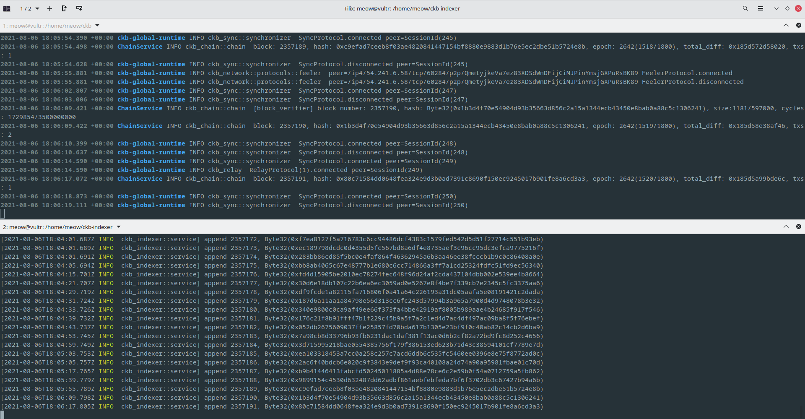

# Task 0

(Upper one) 1. A screenshot of the console output from your local Testnet CKB Node after it has fully synchronized with the network.
2. A screenshot of the console output from your local CKB Indexer after it has fully synchronized with the local Testnet CKB Node. 

Upper one: local Testnet CKB Node
Bottom one: local CKB Indexer

